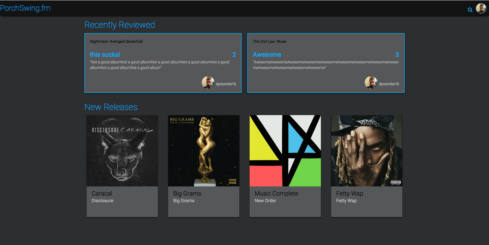

# Porchswing.fm

[Video Walkthrough](https://www.youtube.com/watch?v=HDB1ivI4zNg) 
 
Spotify's application doesn't show an artists concerts, and spotify users can't rate albums. Porchswing lets spotify users login with their spotify account to look up concerts and rate albums.

<h1>Key Features</h1>
Search for an artist.
Get all of that artists albums.
Look up upcoming concerts for that artist.
Look up similar artists to that artist.
Leave a review for albums.
Listen to the album before reviewing.

<h1>Tech Used</h1>
Using passport the user must authenticate with spotify if they want to enter porchswing.
The front end was built with html, css, javascript, and angularJS.
The backend was built with Express (NodeJS),  and Mongoose(MongoDB).
I used three outside APIs in conjunction with my own API. (Spotify, Songkick, and echonest)

